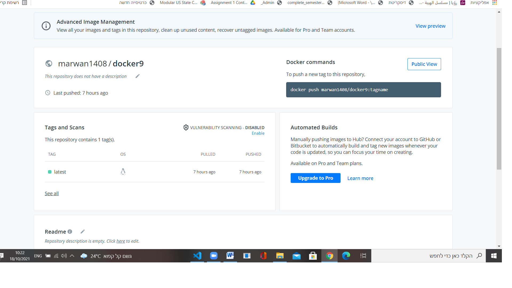

# Docker Final Task
## The App is written in python and runs in Jenkins and pushes the generated Docker image to Docker Hub

### First Step - Cloning the project from github

#### push the application to dockerhub by jenkins pipeline 

#### go to dockerhub 
[link] https://hub.docker.com/repository/docker/marwan1408
#### Here is a result of the project

